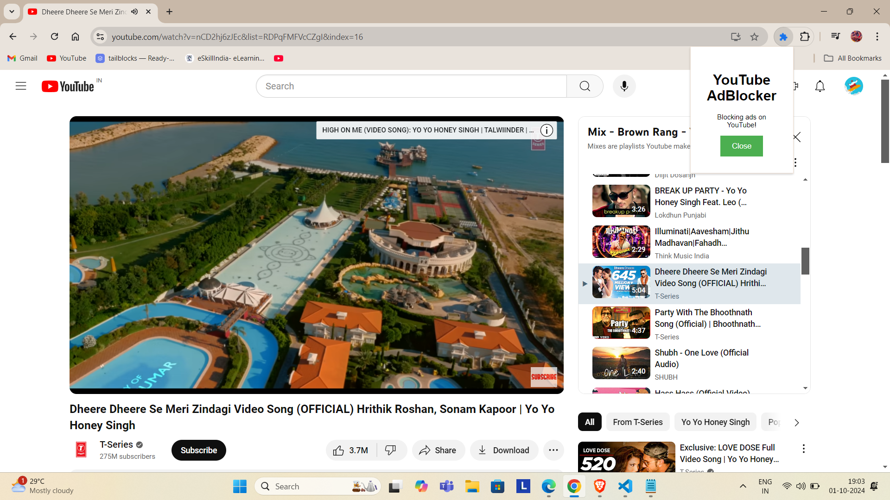

---

# 🚫 YouTube AdBlocker Chrome Extension 🎬


## 📜 Description
**YouTube AdBlocker** is a lightweight Chrome extension that blocks intrusive ads on YouTube, providing you with an uninterrupted video-watching experience. This extension removes banner ads, video overlay ads, and skippable video ads using content scripts and Chrome’s webRequest API.

🔗 [YouTube without ads? Yes, please!](https://github.com/aadesh0706/youtube-adblocker)

---

## 🌟 Features
- 🛡️ Blocks YouTube ads **seamlessly**.
- 🚫 Removes **banner** and **video overlay ads**.
- 🎥 Automatically **skips skippable ads**.
- ⚡ Lightweight and easy to use.
- 🌐 Built with **Manifest v3** for better security and performance.

---

## 🚀 How to Install

1. **Clone** the repository:
   ```bash
   git clone https://github.com/aadesh0706/youtube-adblocker.git
   ```

2. **Load the Extension** into Chrome:
   - Open Chrome and go to `chrome://extensions/`
   - Enable **Developer Mode** in the top-right corner.
   - Click **Load unpacked** and select the folder where you cloned this repository.

3. **Enjoy** YouTube without ads! 🎉

---

## 🖥️ Screenshots

🚀 **Blocking Ads in Action**  


---

## 💡 How it Works
This extension uses two main components:
1. **Background Script (`background.js`)**: Intercepts ad network requests and blocks them.
2. **Content Script (`content.js`)**: Removes ad banners and skips video ads directly on YouTube’s front-end.

With these combined, you get a seamless ad-free experience!

---

## 🎯 Future Enhancements
- 🔄 Auto-updating ad-blocking rules.
- 🌍 International ad-blocking support.
- ⚙️ User-configurable settings in the extension popup.

---

Enjoy YouTube without distractions! 🎉  
Developed with ❤️ by [Aadesh Gulumbe](https://github.com/aadesh0706)

---
